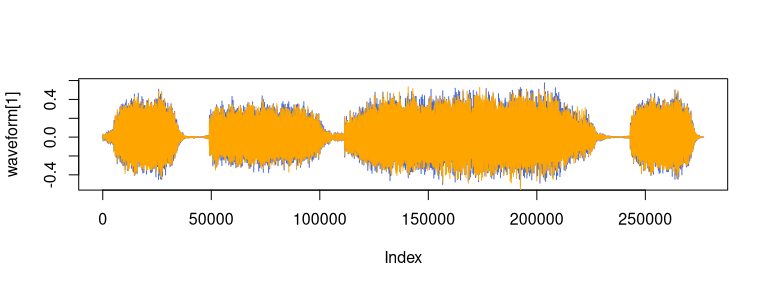
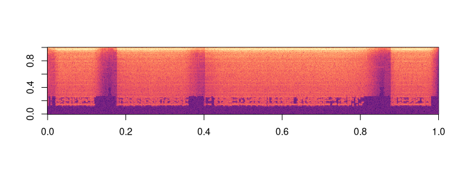

# torchaudio <a href='https://mlverse.github.io/torchaudio/'></a>

<!-- README.md is generated from README.Rmd. Please edit that file -->
<!-- badges: start -->

[](https://lifecycle.r-lib.org/articles/stages.html#experimental)
[](https://github.com/mlverse/torchaudio/actions)
[](https://CRAN.R-project.org/package=torchaudio)
[](https://cran.r-project.org/package=torchaudio)

<!-- badges: end -->

`torchaudio` is an extension for
[`torch`](https://github.com/mlverse/torch) providing audio loading,
transformations, common architectures for signal processing, pre-trained
weights and access to commonly used datasets. The package is a port to R
of [PyTorch’s TorchAudio](https://pytorch.org/audio/stable/index.html).

`torchaudio` was originally developed by [Athos
Damiani](https://github.com/Athospd) as part of
[Curso-R](https://github.com/curso-r) work. Development will continue
under the roof of the *mlverse* organization, together with `torch`
itself, [`torchvision`](https://github.com/mlverse/torchvision),
[`luz`](https://github.com/mlverse/luz), and a number of extensions
building on `torch`.

## Installation

The CRAN release can be installed with:

``` r
install.packages("torchaudio")
```

You can install the development version from GitHub with:

``` r
remotes::install_github("mlverse/torchaudio")
```

## A basic workflow

`torchaudio` supports a variety of workflows – such as training a neural
network on a speech dataset, say – but to get started, let’s do
something more basic: load a sound file, extract some information about
it, convert it to something `torchaudio` can work with (a tensor), and
display a spectrogram.

Here is an example sound:

``` r
library(torchaudio)
url <- "https://pytorch.org/tutorials/_static/img/steam-train-whistle-daniel_simon-converted-from-mp3.wav"
soundfile <- tempfile(fileext = ".wav")
r <- httr::GET(url, httr::write_disk(soundfile, overwrite = TRUE))
```

Using `torchaudio_info()`, we obtain number of channels, number of
samples, and the sampling rate:

``` r
info <- torchaudio_info(soundfile)
cat("Number of channels: ", info$num_channels, "\n")
#> Number of channels:  2
cat("Number of samples: ", info$num_frames, "\n")
#> Number of samples:  276858
cat("Sampling rate: ", info$sample_rate, "\n")
#> Sampling rate:  44100
```

To read in the file, we call `torchaudio_load()`. `torchaudio_load()`
itself delegates to the default (alternatively, the user-requested)
backend to read in the file.

The default backend is [`av`](https://docs.ropensci.org/av/), a fast and
light-weight wrapper for [Ffmpeg](https://ffmpeg.org/). As of this
writing, an alternative is `tuneR`; it may be requested via the option
`torchaudio.loader`. (Note though that with `tuneR`, only `wav` and
`mp3` file extensions are supported.)

``` r
wav <- torchaudio_load(soundfile)
dim(wav)
#> [1]      2 276858
```

For `torchaudio` to be able to process the sound object, we need to
convert it to a tensor. This is achieved by means of a call to
`transform_to_tensor()`, resulting in a list of two tensors: one
containing the actual amplitude values, the other, the sampling rate.

``` r
waveform_and_sample_rate <- transform_to_tensor(wav)
waveform <- waveform_and_sample_rate[[1]]
sample_rate <- waveform_and_sample_rate[[2]]

paste("Shape of waveform: ", paste(dim(waveform), collapse = " "))
#> [1] "Shape of waveform:  2 276858"
paste("Sample rate of waveform: ", sample_rate)
#> [1] "Sample rate of waveform:  44100"

plot(waveform[1], col = "royalblue", type = "l")
lines(waveform[2], col = "orange")
```



Finally, let’s create a spectrogam!

``` r
specgram <- transform_spectrogram()(waveform)

paste("Shape of spectrogram: ", paste(dim(specgram), collapse = " "))
#> [1] "Shape of spectrogram:  2 201 1385"

specgram_as_array <- as.array(specgram$log2()[1]$t())
image(specgram_as_array[,ncol(specgram_as_array):1], col = viridis::viridis(n = 257,  option = "magma"))
```



## Development status

### Datasets ([go to issue](https://github.com/mlverse/torchaudio/issues/17))

- [x] CMUARCTIC
- [ ] COMMONVOICE
- [ ] GTZAN
- [ ] LIBRISPEECH
- [ ] LIBRITTS
- [ ] LJSPEECH
- [x] SPEECHCOMMANDS
- [ ] TEDLIUM
- [ ] VCTK
- [ ] VCTK_092
- [x] YESNO

### Models ([go to issue](https://github.com/mlverse/torchaudio/issues/19))

- [ ] ConvTasNet
- [ ] Wav2Letter
- [x] WaveRNN

## I/O Backends

- [x] {av} (default)
- [x] {tuneR}

## Code of Conduct

Please note that the `torchaudio` project is released with a
[Contributor Code of
Conduct](https://contributor-covenant.org/version/2/0/CODE_OF_CONDUCT.html).
By contributing to this project, you agree to abide by its terms.
